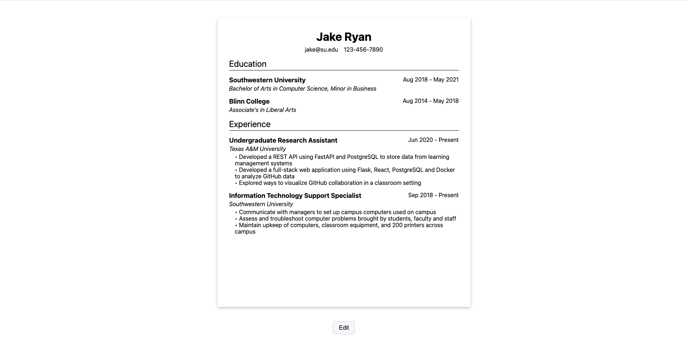

# CV Papa

My implementation of the [CV application project](https://www.theodinproject.com/lessons/node-path-react-new-cv-application) for [The Odin Project](https://www.theodinproject.com/). Try it [here](https://cv-papa.vercel.app/)!

## Description:

This is the first project that I've built using React! It's a small application where users can input their information and generate a CV/résumé. I set up the application using [Vite](https://vitejs.dev/) and deployed it using [Vercel](https://vercel.com/).

## Features:

- Button to automatically fill out input fields so that users can preview a generated example CV
- Button to clear all input fields
- Buttons for adding and deleting educational and work experiences
- Switching between user input form and preview

## What I learned:

- How to use Vite to set up a new React project
- Basics of writing JSX
- Basics of React, including:
  - Writing, rendering, importing and exporting components
  - Rendering lists of components using the `map()` method of Array
  - Conditionally rendering UI
  - Using keys appropriately so that React can handle the DOM effectively and efficiently
  - Passing data between components using props
  - Managing state and sharing state between components
  - Controlling components such as input fields

## Acknowledgements:

[Clipboard favicon](https://favicon.io/emoji-favicons/clipboard) from [favicon.io](https://favicon.io/).

Example CV information from [Jake's resume](https://www.overleaf.com/latex/templates/jakes-resume/syzfjbzwjncs).

Button styles inspired by [GitHub](https://github.com/).
